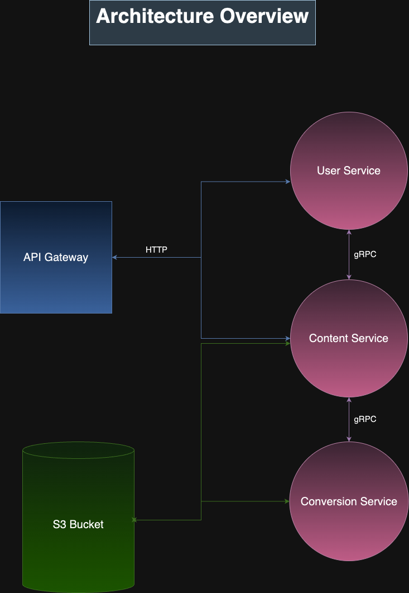
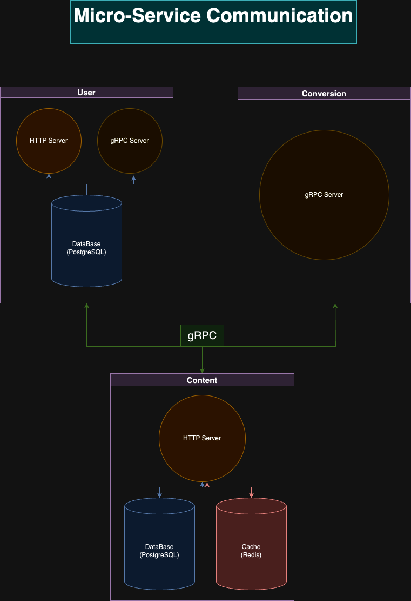
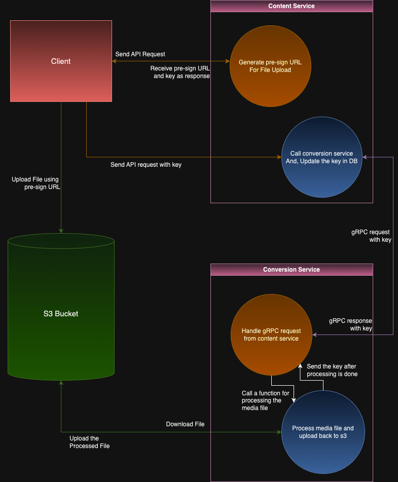

# Spotify Clone

This project is a microservices-based application designed to simulate functionalities similar to Spotify. It's developed with the purpose of understanding gRPC and how to deliver high-quality, low-latency media content.

## Services Overview

The application is divided into three main services:

1. **User Service**

   - **Responsibilities:** Handles user authentication, profile management, and other user-related operations.

   - **Server:** Runs a REST API server for user-related requests and a separate gRPC server for providing user details to other services.

2. **Content Service**

   - **Responsibilities:** Manages basic CRUD operations for content (adding, updating, deleting, etc.)

   - **Interactions:**

     - Calls the User service via gRPC to fetch user details.

     - Uses Redis as a cache to minimize frequent gRPC calls.

     - Triggers a gRPC call to the Conversion service for media file conversion.

   - **Server:** Runs a REST API server for content-related requests.

3. **Conversion Service**

   - **Responsibilities:** Converts audio or video files to HLS format using FFmpeg, uploads the generated file to S3, and returns the new S3 key to the Content service.

   - **Server:** Runs a server for handling gRPC requests exclusively.

## Media Handling Process

1. The Content service provides an endpoint to return a pre-signed URL for direct file uploads to S3, along with a unique key for the file.

2. After the file is uploaded to S3, another endpoint is used to update the database with the unique key.

3. The Content service then calls the Conversion service via gRPC, passing the unique key.

4. The Conversion service downloads the file, converts it to the appropriate format:

   - Audio file is converted to AAC first and then to HLS.

   - Video file is converted to H.265/HEVC and then to HLS.

   Once file is converted, uploads it back to S3, Remove the old media file from S3 and returns the new key to the Content service.

5. The Content service updates the key in the database.

## Infrastructure

1. **API Gateway:** NGINX is used to manage incoming and outgoing requests. Direct access to services without going through NGINX is restricted.

2. **Security:** JWT authentication is used for REST API endpoints, and gRPC communication is secured with an internal secret key.

3. **IaC:** Terraform scripts are provided for setting up AWS infrastructure, including S3 and CloudFront.

4. **Docker:** All services are Dockerized, making it very easy to setup and run this project on any platform or system that has Docker installed on it.

## Getting Started

**Prerequisite:** [Docker](https://www.docker.com/products/docker-desktop/) must be installed on your machine.

1. Clone the project repository to your local machine.

2. Open a terminal and navigate to the project directory.

3. To create an external network for connecting services: `make create-network`

4. To start all the services and the API gateway: `make start-services`

5. To stop all the services: `make stop-services`

**Note:** You can follow terraform official documentation to know what how to setup AWS infrastructure using terraform:

6. [Terraform Tutorial](https://developer.hashicorp.com/terraform/tutorials/aws-get-started/install-cli)

7. [AWS Provider](https://registry.terraform.io/providers/hashicorp/aws/latest/docs)
